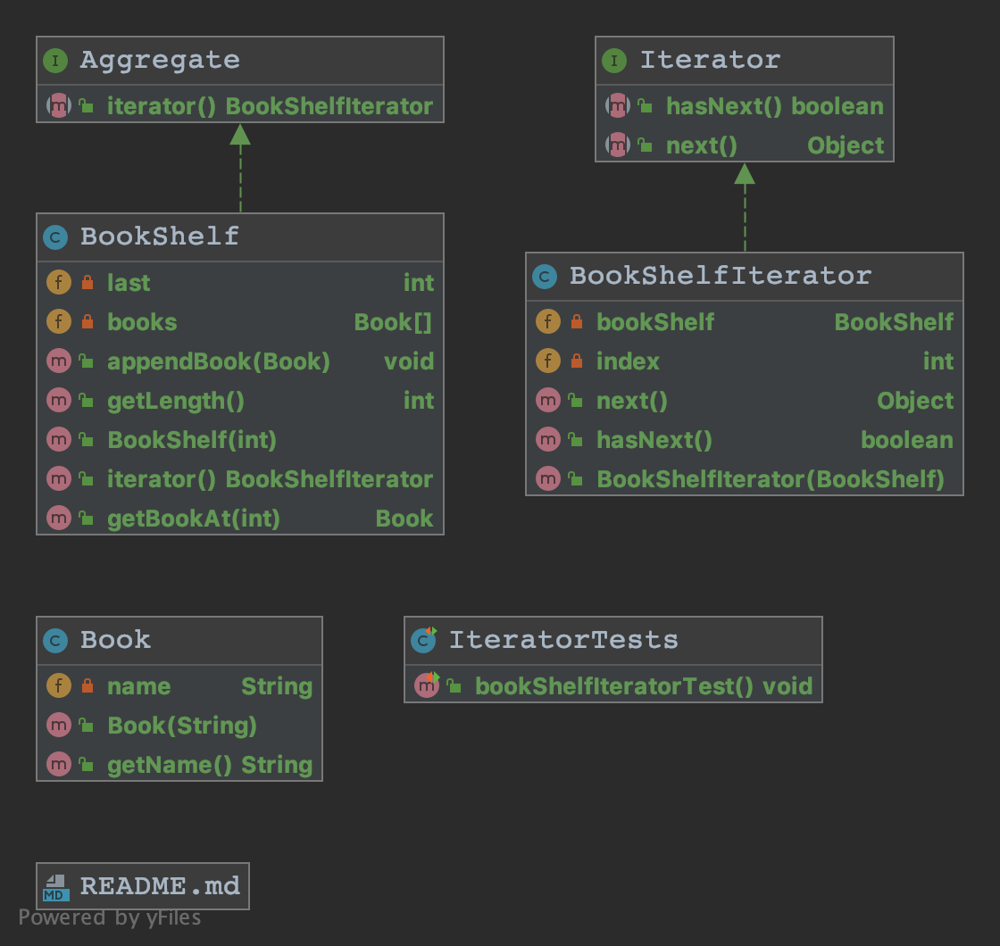
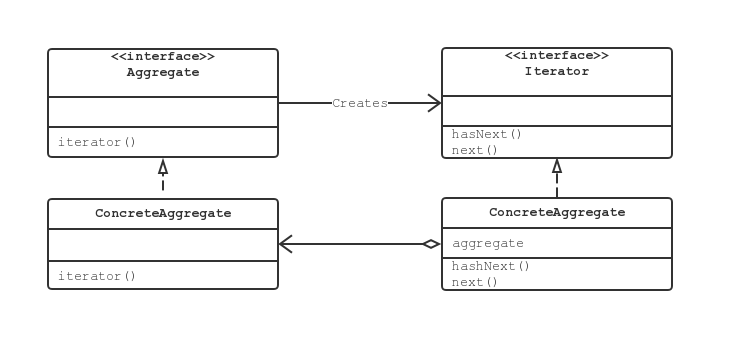

* [Iterator 模式](#iterator-模式)
   * [Iterator 模式中登场的角色](#iterator-模式中登场的角色)
       * [Iterator 迭代器](#iterator-迭代器)
       * [ConcreteIterator 具体迭代器](#concreteiterator-具体迭代器)
       * [Aggregate 集合](#aggregate-集合)
       * [ConcreteAggregate 具体的集合](#concreteaggregate-具体的集合)
   * [拓展思路要点](#拓展思路要点)
       * [不管实现如何变化，都可以使用 Iterator](#不管实现如何变化都可以使用-iterator)
       * [难以理解抽象类和接口](#难以理解抽象类和接口)
       * [Aggregate 和 Iterator 的对应](#aggregate-和-iterator-的对应)
       * [容易弄错『下一个』](#容易弄错下一个)
       * [容易弄错『最后一个』](#容易弄错最后一个)
       * [多个 Iterator](#多个-iterator)
       * [迭代器的种类多种多样](#迭代器的种类多种多样)
       * [不需要 deleteIterator](#不需要-deleteiterator)
   * [相关的设计模式](#相关的设计模式)

# Iterator 模式

## Iterator 模式中登场的角色

### Iterator 迭代器

该角色定义按顺序逐个遍历元素的接口。示例中的 `Iterator` 接口 ，`hasNext()` 用于判断是否存在下一个元素，`next()` 用于获取下一个元素。

### ConcreteIterator 具体迭代器

该角色负责实现 Iterator 角色所定义的接口。该角色中包含了遍历集合所必须的信息。示例中的 `BookShelfIterator` 类，`bookShelf` 保存要遍历的实体书架类，`index` 是被指向书籍的索引。

### Aggregate 集合

该角色负责定义创建 Iterator 角色的接口。它会创建出『按顺序访问保存在内部元素的人』。示例中的 `Aggregate` 接口，定义了 `iterator()` 方法。

### ConcreteAggregate 具体的集合

该角色负责实现 Aggregate 角色所定义的接口。它会创建出 ConcreteIterator 角色。示例中的 `BookShelf` 类，实现了 `iterator()` 方法。

## 拓展思路要点

### 不管实现如何变化，都可以使用 Iterator

如果 `BookShelf` 放弃使用数组来管理 `Book`，而是用 `java.util.Vector` 对于测试类中的 `while` 代码块而言，不需要做任何修改。

个人的理解是：不改变整体流程中的『动作』，而根据需要改变『动作』的『具体实现』。

设计模式的作用就是帮助我们编写可服用的代码，当一个组件发生变化是，不需要对其他组件进行修改或是只需要很小的修改即可应对。

### 难以理解抽象类和接口

如果只是用具体的类来解决问题，很容易导致类之间的强耦合，这些类也难以作为组件被再次利用。为了弱化类之间的耦合，进而使得类更加容易作为组件被再次利用，我们需要引入抽象类和接口。

### Aggregate 和 Iterator 的对应

Aggregate 和 Iterator 两个接口是对应的，ConcreteAggregate 和 ConcreteIterator 也是一一对应的。当 ConcreteAggregate 发生了改变，对应的 ConcreteIterator 也需要对应的改变。

### 容易弄错『下一个』

`next()` 方法是『返回当前元素，并指向下一个元素』。

### 容易弄错『最后一个』

`hasNext()` 是『确认接下来是否可以调用 `next()` 方法』的方法。

### 多个-Iterator

『将遍历功能置于 Aggregate 角色之外』是 Iterator 模式的一个特征。根据这个特征，可以针对一个 ConcreteAggregate 角色编写多个 ConcreteIterator 角色。

### 迭代器的种类多种多样

根据不同需求，可以存在正序遍历的迭代器、逆序遍历的迭代器、指定下标进行跳跃式遍历的迭代器。场景不同，选择不同。

### 不需要 deleteIterator

Java 的 GC 机制会自动的在不需要时清理 ConcreteIterator 占用的内存。

## 相关的设计模式

- Visitor 模式
- Composite 模式
- Factory Method 模式