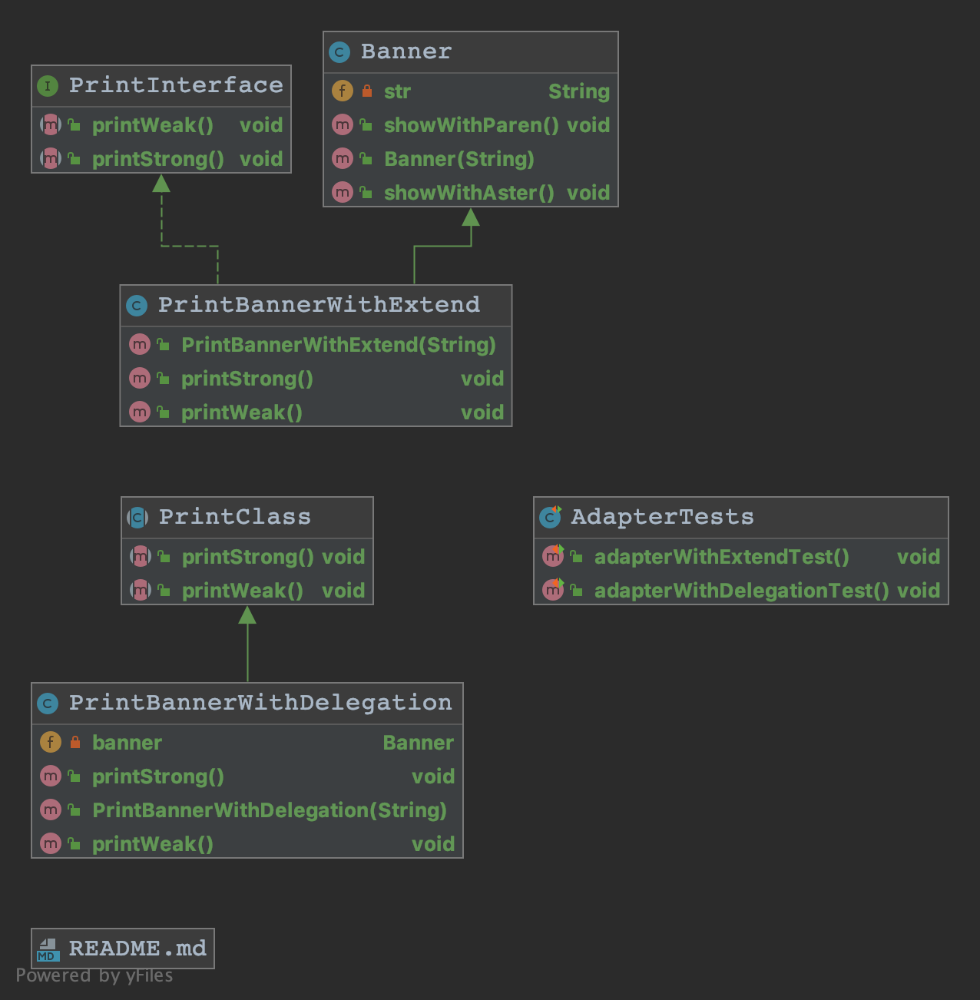
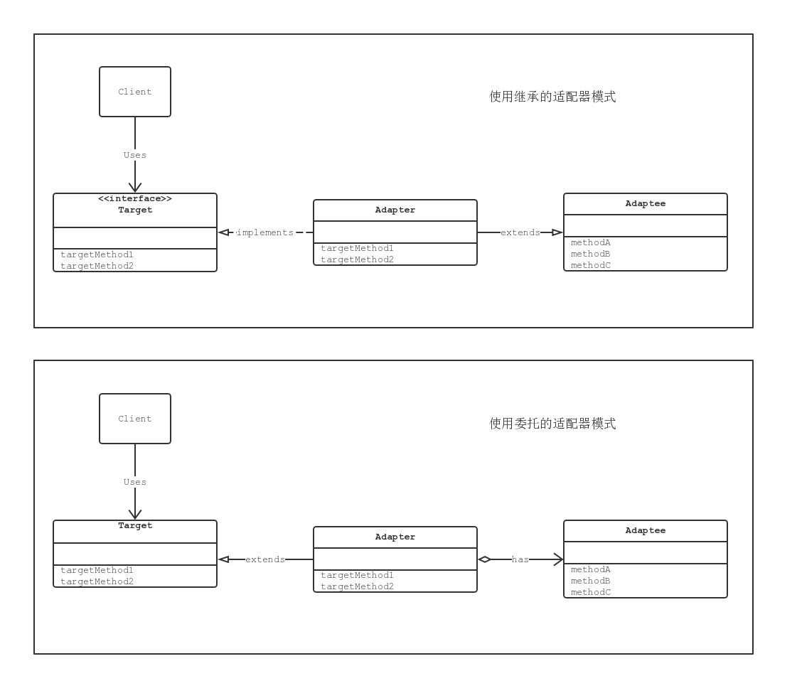
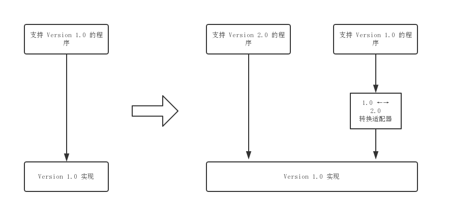

* [Adapter 模式](#adapter-模式)
    * [Adapter 模式中登场的角色](#adapter-模式中登场的角色)
        * [Target 对象](#target-对象)
        * [Client 请求者](#client-请求者)
        * [Adapt-ee 被适配者](#adapt-ee-被适配者)
        * [Adapter 适配器](#adapter-适配器)
    * [拓展思路的要点](#拓展思路的要点)
        * [什么时候使用 Adapter 模式](#什么时候使用-adapter-模式)
        * [如果没有现成的代码](#如果没有现成的代码)
        * [版本升级与兼容](#版本升级与兼容)
        * [功能完全不同的类](#功能完全不同的类)
    * [相关的设计模式](#相关的设计模式)
      
# Adapter 模式

## Adapter 模式中登场的角色

### Target 对象

该角色负责定义所需的方法。如让笔记本电脑正常工作所需的直流 12 伏特电源。示例中，使用继承时的 `PrintInterface` 接口和使用委托时的 `PrintClass` 类。

### Client 请求者

该角色负责使用 Target 角色所定义的方法进行具体处理。如直流 12 伏特电源所驱动的笔记本电脑。示例中，`AdapterTests` 测试类。

### Adapt-ee 被适配者

该角色是一个持有既定方法的角色。如 220 伏特交流电源。示例中，`Banner` 类。如果 Adapt-ee 角色的方法与 Target 角色的方法相同（如笔记本电脑需要 100 伏特交流电源，插座提供的也是 100 伏特交流电源），就不需要 Adapter 角色了。

### Adapter 适配器

使用 Adapt-ee 角色的方法来满足 Target 角色的需求。如将 100 伏特交流电压转换为 12 伏特直流电压的适配器。示例中，`PrintBannerWithExtend` 和 `PrintBannerWithDelegation` 类。

## 拓展思路的要点

### 什么时候使用 Adapter 模式

很多时候，我们并非从零开始编程，经常会用到现有的类。特别是当现有的类已经被充分测试过，Bug 很少，而且已经被用于其他软件之中时，我们更愿意将这些类作为组件重复利用。

Adapter 模式会对现有的类进行适配，生成新的类。通过该模式可以很方便的创建我们需要的方法群。当出现 Bug 时，由于我们很明确的知道 Bug 不是在现有的类（Adaptee 角色）中，所以只需要调查扮演 Adapter 角色的类即可。这样一来，代码问题的排查就会变得非常简单。

### 如果没有现成的代码

实际工作中，我们在让现有的类适配新的接口时，常常会有『只要将这里稍微修改下就可以了』的想法，一不留神就会修改现有的代码。需要注意的是，如果要对已经测试完毕的现有代码进行修改，就必须在修改后重新测试。

使用 Adapter 模式可以在完全不改变现有代码的前提下使现有代码适配于新的接口。此外，在 Adapter 模式中，并非一定需要现成的代码。只要知道现有类的功能，就可以编写出新的类。

### 版本升级与兼容

### 功能完全不同的类

当 Adapt-ee 角色和 Target 角色的功能完全不同时，则不应该使用 Adapter 模式。如我们无法让电源插座流水一样。

## 相关的设计模式

- Bridge 模式
- Decorator 模式