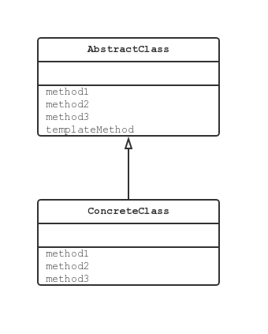

* [Template Method 模式](#template-method-模式)
    * [Template Method 模式中登场的角色](#template-method-模式中登场的角色)
        * [AbstractClass 抽象类](#abstractclass-抽象类)
        * [ConcreteClass 具体类](#concreteclass-具体类)
    * [拓展思路的要点](#拓展思路的要点)
        * [可以使逻辑处理通用化](#可以使逻辑处理通用化)
        * [父类与子类之间的协作](#父类与子类之间的协作)
        * [父类与子类的一致性](#父类与子类的一致性)
    * [相关的设计模式](#相关的设计模式)
    * [延伸阅读：类的层次与抽象类](#延伸阅读类的层次与抽象类)
        * [父类对子类的要求](#父类对子类的要求)
        * [抽象类的意义](#抽象类的意义)
        * [父类与子类之间的协作](#父类与子类之间的协作-1)
         
# Template Method 模式

## Template Method 模式中登场的角色

### AbstractClass 抽象类

AbstractClass 角色不仅负责实现模板方法，还负责声明在模板方法中所使用到的抽象方法。示例中，`AbstractDispaly` 类。

### ConcreteClass 具体类

该角色负责具体实现 AbstractClass 角色中定义的抽象方法。示例中，`CharDisplay` 和 `StringDisplay` 类。

## 拓展思路的要点

### 可以使逻辑处理通用化

Template Method 模式的优点是由于在父类的模板方法中编写了算法，因此无需在每个子类中再编写算法。

个人的理解是，重要的业务流程交由父类控制，根据具体业务的不同，可以由子类控制具体某个步骤的实现方法。

### 父类与子类之间的协作

在子类中实现父类中声明的抽象方法时，必须要理解这些抽象方法被调用的实际。在看不到父类源码的情况下，想要编写出子类是非常困难的。

### 父类与子类的一致性

在示例程序中，不论是 `CharDisplay` 的实例还是 `StringDisplay` 的实例，
都是先保存在 `AbstractDisplay` 类型的变量中，然后再来调用 `display()` 方法的。

使用父类类型的变量保存子类实例的优点是，及时没有用 instanceof 等指定子类的种类，程序也能正常工作。

无论是在父类类型的变量中保存哪个子类的实例，程序都可以正常工作，这种原则称为里氏替换原则（The Liskov Substitution Principle，LSP）。

## 相关的设计模式

- Factory Method 模式

FactoryMethod 模式是将 Template Method 模式用于生成实例的一个典型例子。

- Strategy 模式

在 Template Method 模式中，可以**使用继承改变程序的行为**。
这是因为 Template Method 模式在父类中定义程序行为的框架，在子类中决定具体的处理。

榆次相对的是 Strategy 模式，它可以**使用委托改变程序的行为**。
与 Template Method 模式中改变部分程序行为不同的是，Strategy 模式用于替换整个算法。

## 延伸阅读：类的层次与抽象类

### 父类对子类的要求

我们在理解类的层次时，通常是站在子类的角度进行思考的。也就是说，很容易着眼于以下几点：

- 在子类中可以只用父类中定义的方法
- 可以通过在子类中增加方法以实现新的功能
- 在子类中重写父类的方法可以改变程序的行为

现在，让我们稍微改变一下立场，站在父类的角度进行思考。在父类中，我们声明了抽象方法，而将该方法的实现交给了子类。
换言之，就程序而言，声明抽象方法是希望达到以下目的：

- 期待子类去实现抽象方法
- 要求子类去实现抽象方法

也就是说，子类具有实现在父类中所声明的抽象方法的责任。因此，这种责任被称为『子类责任』（subclass responsibility）。

### 抽象类的意义

由于在抽象方法中没有编写具体的实现，所以我们无法知道在抽象方法中到底进行了什么样的处理。
但是我们可以决定抽象方法的名字，然后通过调用使用了抽象方法的模板方法去编写处理。
虽然具体的处理内容是由子类决定的，不过**在抽象类阶段确定处理的流程**非常重要。

### 父类与子类之间的协作

父类与子类的相互协作支撑起了整个程序。虽然将更多方法的实现放在父类中会让子类变得更轻松，但是同时也降低了子类的灵活性；
反之，如果父类中实现的方法过少，子类就会变得臃肿不堪，而且还会导致各个子类间的代码出现重复。

在 Template Method 模式中，处理的流程被定义在父类中，而具体的处理则交给了子类。
但是对于『如何花费处理的级别，哪些处理需要由父类完成，哪些处理需要交给子类负责』并没有定式，这些都需要负责程序设计的开发人员来决定。
