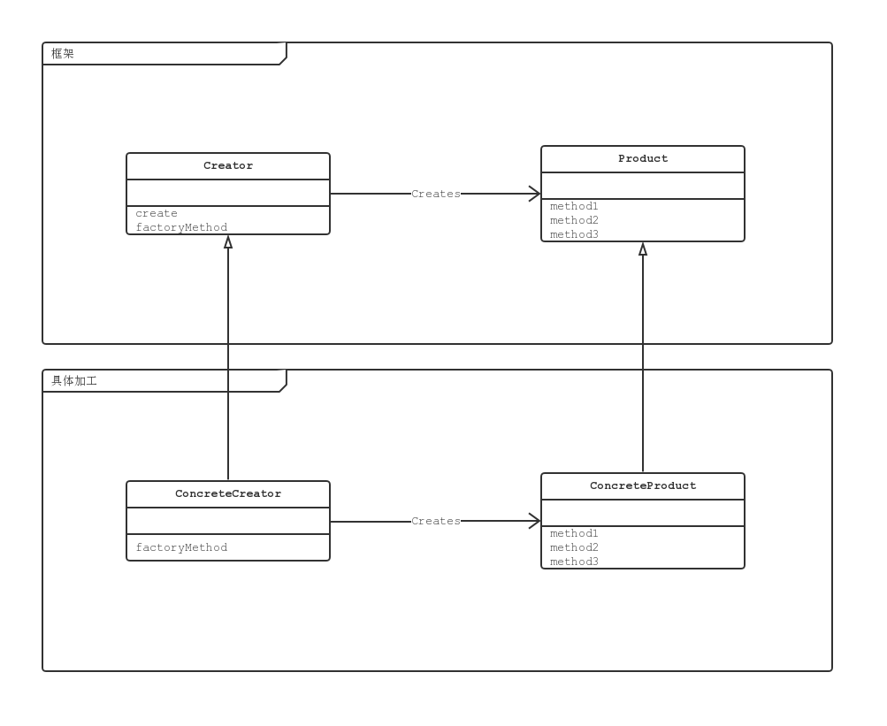

* [Factory Method 模式](#factory-method-模式)
    * [Factory Method 模式中登场的角色](#factory-method-模式中登场的角色)
        * [Product 产品](#product-产品)
        * [Creator 创建者](#creator-创建者)
        * [ConcreteProduct 具体的产品](#concreteproduct-具体的产品)
        * [ConcreteCreator 具体的创建者](#concretecreator-具体的创建者)
    * [拓展思路的要点](#拓展思路的要点)
        * [框架与具体加工](#框架与具体加工)
        * [生成实例方法的三种实现方式](#生成实例方法的三种实现方式)
        * [使用模式与开发人员之间的沟通](#使用模式与开发人员之间的沟通)
    * [相关的设计模式](#相关的设计模式)

# Factory Method 模式


## Factory Method 模式中登场的角色

### Product 产品

Product 角色定义了在 Factory Method 模式中生成的那些实例所持有的接口，
但具体的处理则由子类 ConcreteProduct 角色决定。示例中，`Product` 类。

### Creator 创建者

Creator 负责生成 Product，单具体的处理由子类 ConcreteCreator 角色决定。
示例中，`Factory` 类。

Creator 角色对于实际负责生成实例的 ConcreteCreator 角色一无所知，
只要调用 Product 角色和生成实例的方法，就可以生成 Product 的实例。
**不用 `new` 关键字来生成实例，而是调用生成实例的专用方法来生成实例，
这样就可以防止父类与其他具体类耦合。**

### ConcreteProduct 具体的产品

ConcreteProduct 角色决定了具体的产品。示例中，`IDCard` 类。

### ConcreteCreator 具体的创建者

ConcreteCreator 负责生成具体的产品。示例中，`IDCardFactory` 类。



## 拓展思路的要点

### 框架与具体加工

使用已有的框架生成全新的类时，完全不需要对 framework 进行修改。

### 生成实例方法的三种实现方式

- **指定其为抽象方法**：一旦将 createProduct 指定为抽象方法后，子类就必须实现该方法。
如果未在子类中实现该方法，程序会在编译时报错。

```java
abstract class Factory {
   public abstract Product createProduct(String name); 
}
```

- **为其实现默认处理**：实现默认处理后，如果子类没有实现该方法，将进行默认处理。

```java
class Factory {
    public Product createProduct(String name) {
        return new Product(name);
    }
}
```

不过，这时是使用 `new` 关键字创建出实例的，因此不能将 `Product` 类定义为抽象类

- **在其中抛出异常**：如果未在子类中实现该方法，程序会在运行时报错。

```java
class Factory {
    public Product createProduct(String name) {
        throw new FactoryMethodRuntimeException();
    }
}
```

不过，需要另外编写 FactoryMethodRuntimeException 异常类。

### 使用模式与开发人员之间的沟通

通常，使用设计模式设计类时，必须要想维护这些类的开发人员正确的传达设计这些设计模式的意图。
否则，维护人员在修改设计时可能会违背设计者最初的意图。
这时，建议在程序注释中和开发文档中记录所使用的设计模式的名称和意图。

## 相关的设计模式

- Template Method 模式

Factory Method 模式时 Template Method 的经典应用。在示例程序中，`create()` 方法就是模板方法。

- Singleton 模式

在多数情况下我们都可以将 Singleton 模式用于扮演 Creator 角色（或是 ConcreteCreator 角色）的类。
这是因为在程序中没有必要存在多个 Creator 角色的实例。

- Composite 模式

有时可以将 Composite 模式用于 Product 角色（或是 ConcreteProduct 角色）。

- Iterator 模式

有时，在 Iterator 模式中使用 `iterator()` 方法生成 `Iterator` 的实例时，
会使用 Factory Method 模式