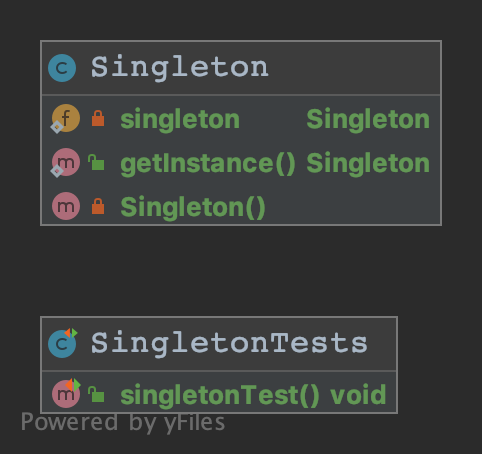
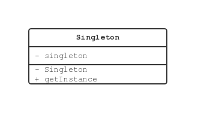

# Singleton 模式

## Singleton 模式中登场的角色

### Singleton 单例

在 Singleton 模式中，只有 Singleton 一个角色。
Singleton 角色中有一个返回唯一实例的 static 方法。
该方法总是返回同一个实例。

## 拓展思路的要点

### 为什么必须设置限制

Singleton 模式对实例的数量设置了限制。
设置限制其实就是为了程序增加一项前提条件。

当存在多个实例时，实例之间项目影响，可能会产生意想不到的 BUG。
但是，如果我们可以确保只有一个实例，就可以在这个前提条件下放心的编程了。

### 何时生成这个唯一的实例

程序运行后，在第一次调用 `getInstance()` 方法时，`Singleton` 会被初始化。
也就是在这个时候，`static` 字段 `singleton` 被初始化，生成了唯一的一个实例。

**重要**：书内所使用的代码样例，并非严格的 Singleton 模式。
书后也在『习题 5-3』中做了提问，之后会在做习题时对单例模式作详细展开。