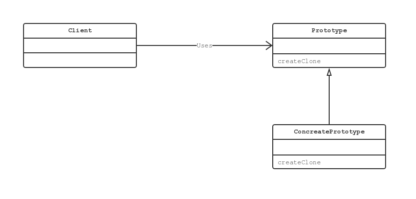

# Prototype 模式

## Prototype 模式中登场的角色

### Prototype 原型

Protoduct 角色复制定义用于复制现有实例来生成新实例的方法。示例中，`Product` 接口。

### ConcretePrototype 具体的原型

ConcretePrototype 角色负责实现复制现有实例并生成新实例的方法。示例中，`MessageBox` 和 `UnderlinePen` 类。

### Client 使用者

Client 角色负责使用复制实例的方法生成新的实例。示例中，`Manager` 类。

## 拓展思路的要点

### 不能根据类来生成实例吗

1. 对象种类繁多，无法将他们整合到一个类中的时候
2. 难以根据类生成实例的时候
3. 想解耦框架与生成实例的时候

### 类名是束缚吗

一旦在代码中出现要使用的类名，就无法与该类分离开来，也就无法实现复用。

以 Java 来说，重要的是当手边只有 .class　文件时，该类能否被复用。即使没有 .java 文件 也能复用该类才是关键。

## 相关的设计模式

- Flyweight 模式

使用 Prototype 模式可以生成一个与当前实例的状态完全相同的实例。

而使用 Flyweight 模式可以在不同的地方使用同一个实例。

- Memento 模式

使用 Memento 模式可以保存当前实例的状态，以实现快照和撤销功能。

- Composite 模式以及 Decorator 模式

经常使用 Composite 模式和 Decorator 模式时，需要能够动态的创建复杂结构的实例。
这时可以使用 Prototype 模式，以帮助我们方便的生成实例。

- Command 模式

想要复制 Command 模式中出现的命令时，可以使用 Prototype 模式。
